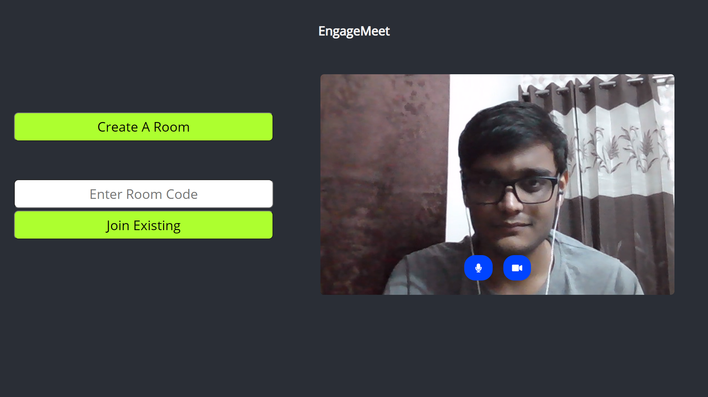
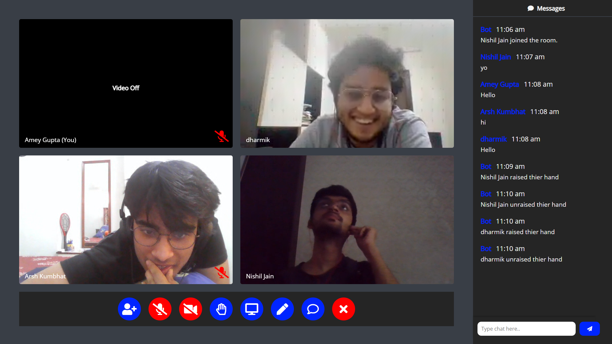
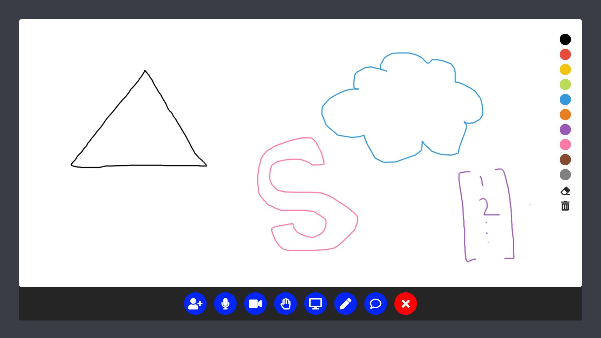
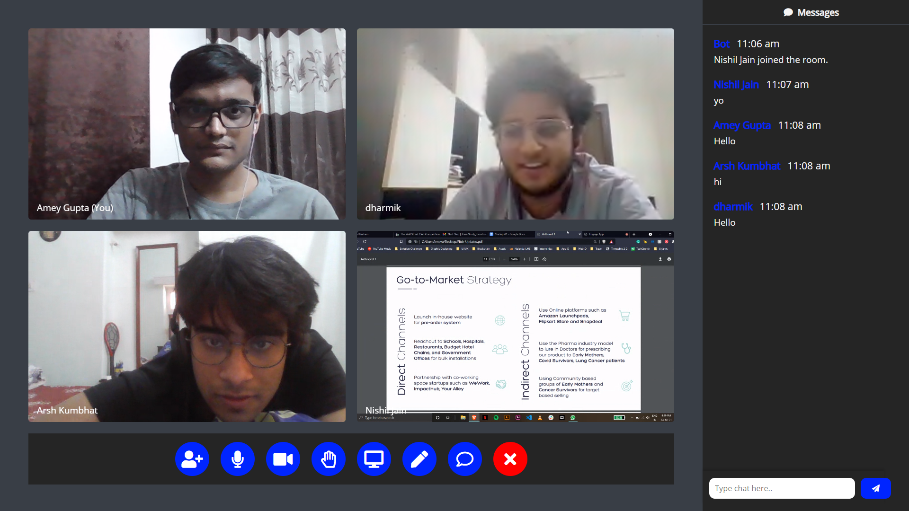

# Microsoft Teams Clone - Engage 2021
A Microsoft Teams clone built with node.js using WebRTC and socket.io for the Miscrosoft Engage 2021 Mentorship Programme.

## Deployed Link : [Click Here!](https://amey-engage.herokuapp.com/)

### IMPORTANT: Please set the zoom to 80% in the browser for the best User Experience

## Working Features
- Multi User Video and Audio Calling
- In-Built Collaborative Whiteboard for particapants to share diagrams and sketches
- User Controls to Mute and Switch Off Camera
- Users can share their Screen, An Application Window or A Browser Tab
- Users can invite other participants to join the meeting room with a click of the button
- In-Built Chatroom for all paricipants
- Raise Hand fucntionality for participants to come into the speaker's attention

 
 

The homepage of the application. Users can join with a roomcode or host a new room.
 
 
 
 

The application allows multiple users to connect.
 
 
 
 

The application has an integrated collaborative whiteboard for users to share their ideas.
 
 
 
 

Users can share their screens with the other participants.
$~$
$~$
 
 

## Way Forward (Features yet to be implemented)
- Build a completely responsive frontend for the application to work seamlessly cross-platform
- OAuth 2.0 based user authentication
- Host Controls (Allow the bost to mute, remove, turn off camera, ban from chat a particular user)
- Minor Bug Fixes

## Bugs
- Whiteboard pointer gets offsetted to the left when the chat drawer is open
- Frontend breaks after 6 users join the room, even though the backend supports multiple users
- The last message in a chat window often gets overlayed by the chat input box
